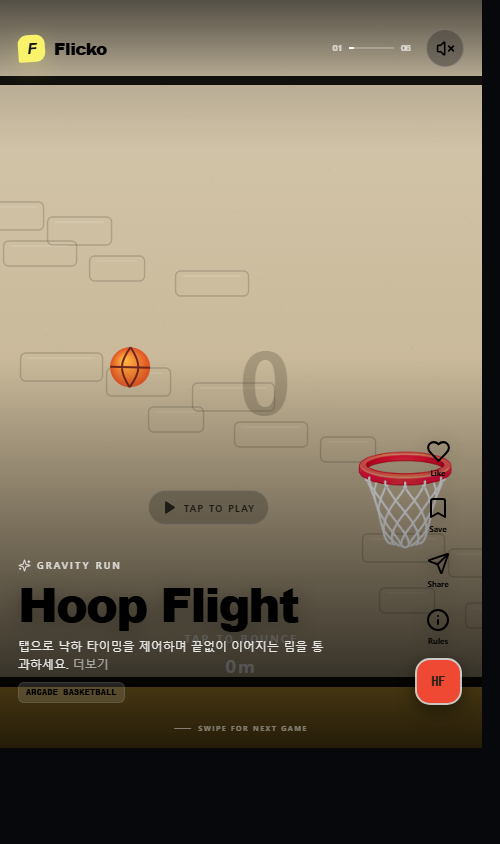
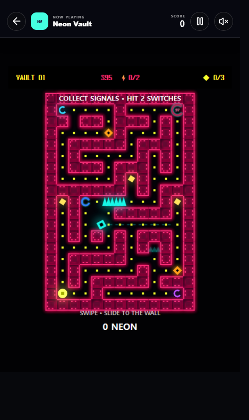
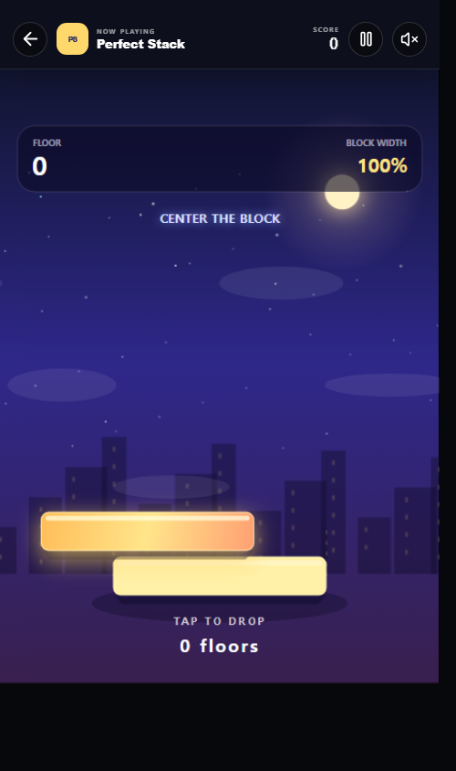
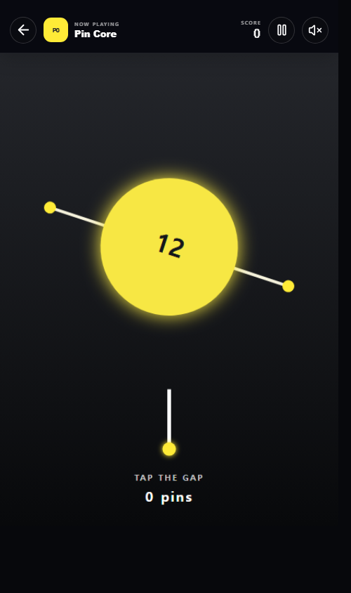

<div align="center">

# Flicko

### The Instagram & TikTok for Mobile Games

**게임은 콘텐츠가 되고, 플레이는 피드가 된다.**

피드를 넘기며 새로운 게임을 발견하고,<br>
다운로드하기 전에 바로 플레이하는 모바일 게임 소셜 플랫폼.

[](https://rudwndgus.github.io/Flicko/)

> **Scroll. Play. Discover.**

</div>

---

<table>
  <tr>
    <td width="25%"></td>
    <td width="25%"></td>
    <td width="25%"></td>
    <td width="25%"></td>
  </tr>
  <tr align="center">
    <td><sub>게임을 발견하는 피드</sub></td>
    <td><sub>Neon Vault</sub></td>
    <td><sub>Perfect Stack</sub></td>
    <td><sub>Pin Core</sub></td>
  </tr>
</table>

## Flicko가 시작된 질문

사진을 보고 싶을 때는 Instagram을, 짧은 영상을 보고 싶을 때는 TikTok을, 음악을 듣고 싶을 때는 Spotify를 엽니다.

그런데 **“재미있는 게임 하나 없나?”**라는 생각이 들었을 때 자연스럽게 가장 먼저 여는 서비스는 아직 명확하지 않습니다. 게임은 여전히 검색하고, 광고와 스크린샷을 보고, 다운로드하고, 설치한 뒤에야 재미있는지 알 수 있습니다.

Flicko는 이 과정을 바꾸고 싶다는 질문에서 시작되었습니다.

> 게임도 사진이나 영상처럼 자연스럽게 발견할 수 있고,<br>
> 광고 영상이 아니라 **실제 플레이**로 판단할 수 있다면?

## 왜 Flicko가 필요한가

모바일 게임 시장에는 매일 새로운 게임이 등장하지만, 많은 게임은 충분한 사용자에게 닿지 못한 채 사라집니다. 플레이어는 재미있는 게임 하나를 찾기 위해 긴 탐색과 설치 과정을 감수해야 하고, 작은 개발팀은 게임의 실제 재미를 보여주기도 전에 마케팅 예산과 인지도라는 벽을 만납니다.

<div align="center">

### 좋은 게임은 발견되지 못하고,<br>
### 좋은 플레이어는 좋은 게임을 만나지 못합니다.

</div>

Flicko는 게임의 발견 가능성이 광고비보다 **실제 재미**에 가까워지는 환경을 만들고자 합니다.

## Flicko가 바꾸는 경험

| 기존의 발견 과정 | Flicko가 만드는 발견 과정 |
| --- | --- |
| 검색 → 광고·스크린샷 → 다운로드 → 설치 → 실행 → 재미 판단 | 발견 → **즉시 플레이** → 재미 판단 → 저장·공유·다운로드 |

<div align="center">

### 다운로드보다 플레이가 먼저입니다.

</div>

사용자는 게임을 찾기 위해 긴 검색을 하지 않습니다. 피드를 넘기다가 흥미로운 게임을 발견하고, 화면을 탭해 핵심 재미를 직접 경험합니다. 재미가 없다면 다음 게임으로, 재미가 있다면 다시 도전하고 저장하거나 친구에게 공유합니다.

**게임을 찾는 것이 아니라, 게임이 사용자를 찾아옵니다.**

## Core Experience

| 01 · Scroll | 02 · Tap to Play | 03 · Replay or Continue | 04 · Save, Share & Follow |
| --- | --- | --- | --- |
| 세로형 피드를 넘기며 다양한 게임을 발견합니다. | 광고 영상이 아닌 실제 게임을 즉시 플레이합니다. | 기록에 다시 도전하거나 자연스럽게 다음 게임으로 이동합니다. | 마음에 든 게임을 저장하고 공유하며 개발자와 연결됩니다. |

Flicko에서 플레이는 피드의 흐름을 끊는 별도 과정이 아닙니다. **발견과 플레이가 하나의 경험**으로 이어집니다.

## 지금 만들고 있는 것

현재 Flicko는 이 발견 방식을 검증하기 위한 모바일 PWA 프로토타입입니다. 한 손으로 빠르게 이해하고 반복해서 도전할 수 있는 8개의 **Flicko Originals**를 실제 플레이 가능한 피드로 제공합니다.

- 긴 설명 없이 핵심 재미가 바로 전달되는 게임
- 짧은 시간에도 기록과 재도전 동기가 생기는 게임
- 설치 없이 모바일 브라우저에서 빠르게 실행되는 게임
- Flicko만의 규칙과 시각적 정체성을 가진 게임

Originals는 단순히 게임 수를 채우기 위한 콘텐츠가 아닙니다. 게임이 광고가 아니라 **스스로를 소개하는 플레이어블 콘텐츠**가 될 수 있는지 실험하는 첫 출발입니다.

## 플레이어와 개발자에게 생기는 변화

| For Players | For Developers |
| --- | --- |
| 검색과 설치 전에 실제 재미를 확인합니다. | 광고 영상 대신 실제 플레이로 게임을 보여줍니다. |
| 과장된 광고가 아닌 자신의 경험으로 판단합니다. | 적은 예산으로도 발견될 기회를 얻습니다. |
| 앱스토어에서 놓치기 쉬운 인디게임을 만납니다. | 플레이어의 반응을 더 빠르게 확인합니다. |
| 친구와 게임과 기록을 공유하고 함께 도전합니다. | 한 게임을 넘어 개발자를 좋아하는 팬을 만듭니다. |

Flicko에서 개발자는 단순한 광고주가 아니라 하나의 **크리에이터**가 됩니다. 게임 하나의 성공 여부를 넘어, 자신의 다음 작품을 기다리는 사람들과 관계를 이어갈 수 있습니다.

## 우리가 그리는 미래

현재의 플레이어블 피드를 시작으로 Flicko는 다음 경험을 향해 나아갑니다.

### 취향을 이해하는 발견

플레이 시간, 재도전, 좋아요, 저장과 팔로우를 바탕으로 사용자가 좋아할 게임을 먼저 제안합니다.

### 기록으로 연결되는 소셜 플레이

친구의 기록을 보고 바로 도전하고, 게임과 플레이 결과를 공유하며 함께 새로운 재미를 발견합니다.

### 팬을 만드는 개발자 커뮤니티

개발자가 게임과 제작 과정을 소개하고 플레이어와 직접 소통하며, 다음 작품까지 이어지는 팬을 만듭니다.

### 재미가 국경을 넘는 인디 생태계

마케팅 규모와 지역에 상관없이 게임의 실제 재미만으로 전 세계 플레이어에게 발견되는 환경을 꿈꿉니다.

사용자가 많아질수록 좋은 게임이 더 많이 발견되고, 좋은 게임이 많아질수록 더 많은 사용자가 찾아옵니다. Flicko는 이 선순환이 게임 발견의 새로운 기준이 되기를 바랍니다.

## Vision

<div align="center">

### We don't want to change how games are advertised.<br>
### We want to change how games are discovered.

우리는 게임을 광고하는 방식을 바꾸려는 것이 아닙니다.<br>
**게임을 발견하는 방식을 바꾸고 싶습니다.**

<br>

[**Flicko에서 지금 플레이하기 →**](https://rudwndgus.github.io/Flicko/)

모바일 Safari와 Chrome에서 홈 화면에 추가하면 앱처럼 실행할 수 있습니다.

</div>

<details>
<summary><strong>개발 환경에서 실행하기</strong></summary>

Node.js 20 이상이 필요합니다.

```bash
npm install
npm run dev
```

변경 사항을 확인하려면 아래 검증을 실행합니다.

```bash
npm run lint
npm run test
npm run build
```

</details>

---

<div align="center">

**Flicko** · Scroll. Play. Discover.

</div>
